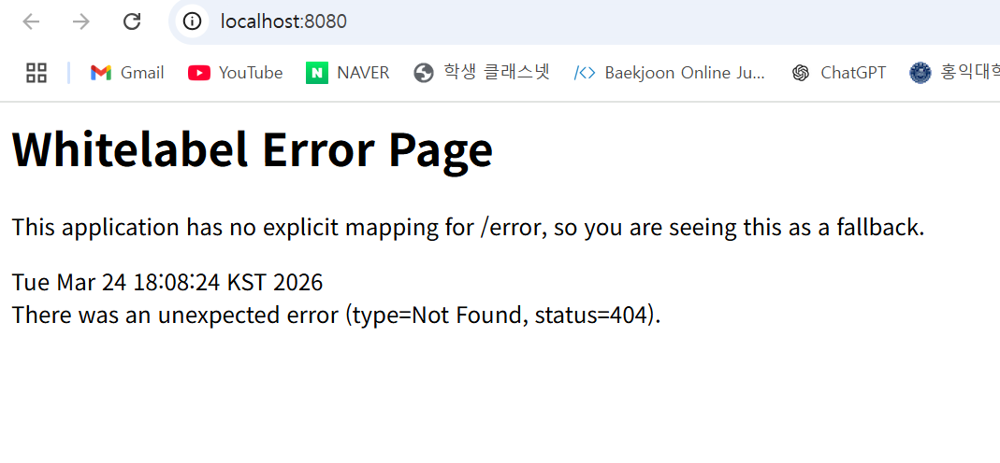

# 1주차 WIL
## 1. 학습한 내용
### 웹 작동방식 
-  클라이언트-서버 모델
    - 클라이언트 : 요청을 보내고, 서버의 응답 결과를 받아 사용
    - 서버 : 클라이언트의 요청을 받아 처리하고, 그에 대한 응답을 반환

### URL
- 정의 : 웹 상에서 특정 자원의 위치를 나타내는 주소
- 구조
    - Host : 리소스가 위치한 서버의 IP 주소 혹은 도메일
    - Port : 서버의 특정 네트워크 포트 번호
    - Path : 서버 내에서 원하는 리소스의 경로
    - Query : 서버에 추가적인 정보를 보내는 파라미터
    - Scheme : 컴퓨터와 같은 장치들 사이의 데이터 통신 규칙

### HTTP
- 웹에서 데이터를 주고받는 클라이언트-서버 모델의 프로토콜
- 특징
    - 무상태성 : 서버가 클라이언트의 이전 요청 저장 X, 매 요청 독립적으로 처리
    - 비연결성 : 클라이언트가 요청을 보내고 응답을 받은 후 서버와 연결 유지 X
- 구조
    - <요청>
    - start line : 요청 메서드
        - 메서드 종류
            - GET : 리소스 조회
            - POST : 리소스 추가, 등록
            - PUT : 리소스 교체, 없으면 새로 생성
            - PATCH : 리소스 일부 수정
            - DELETE : 리소스 수정
    - headers : 요청에 대한 부가 정보
    - body : 실제 전송할 데이터
    
    - <응답>
    - status line : HTTP 버전, HTTP 상태 코드, 상태 메시지
        - 상태 코드 종류
            - 200 OK : 요청이 성공적으로 처리됨
            - 201 Created : 요청이 성공적으로 처리되어 새로운 리소스 생성
            - 400 Bad Request : 클라이언트 요청이 잘못되어 서버 이해 X
            - 404 Not Found : 지정한 리소스 찾지 못함
            - 500 Internal Server Error : 서버 내부 오류로 요청 처리 X
    - headers
    - body

### API
- 정의 : 한 프로그램이 다른 프로그램의 기능이나 데이터를 사용할 수 있도록 미리 정해놓은 약속

### REST
- 정의 : HTTP의 장점을 최대한 활용할 수 있는 아키텍쳐
- 구성요소
    - 자원 : HTTP URI
    - 행위 : HTTP Method
    - 표현 : 서버와 클라이언트가 데이터를 주고 받는 형식 (JSON이 일반적)

## 2. 실행화면 스크린샷
